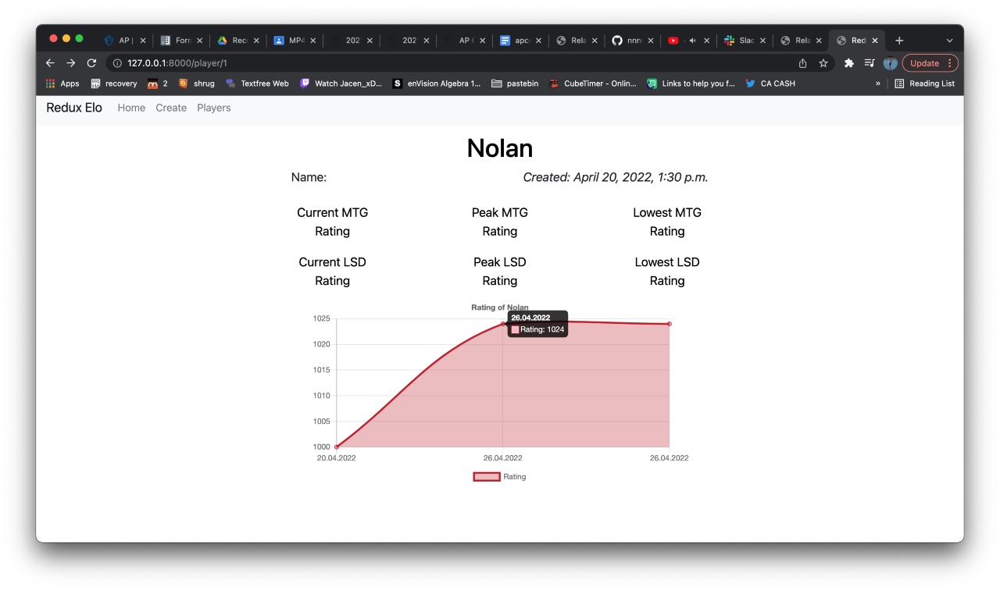
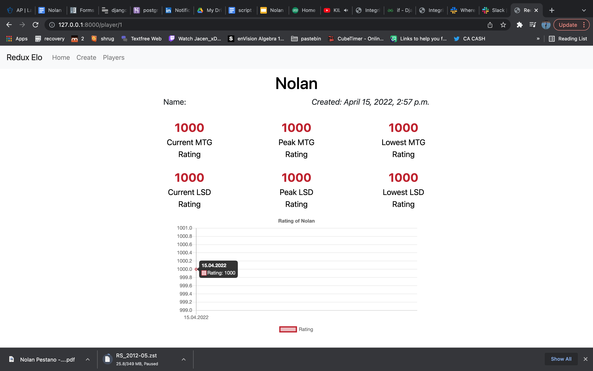

# Redux Society 

Redux Society is a local hobby store in Kansas City that serves readers, gamers, and various forms of nerds.

One of their most unique hobbies is a fully fleged lightsaber duel league. 🤺
Myself and a co-intern were tasked with creating an app to track players, and create an ELO system.

I created the user and website layout. We used Python's Django to setup the website, and I had a lot of fun tinkering with ChartJS.

